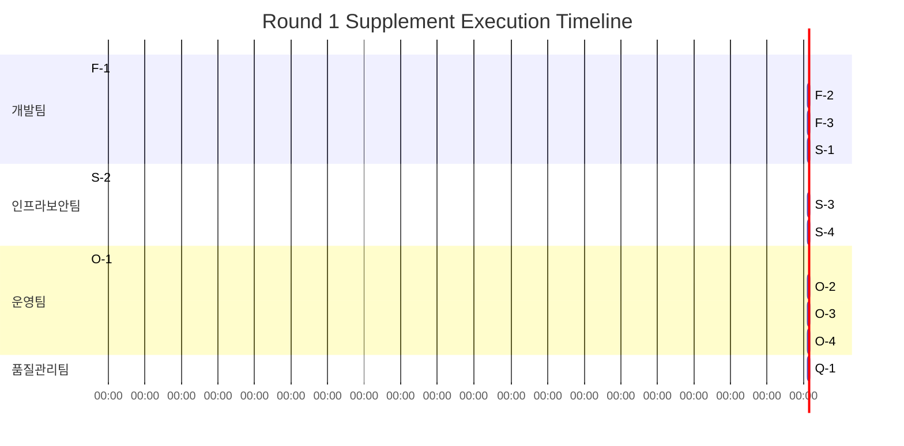

# Round 1 Supplement Submission
**Task:** [feat] 강의 관리 CRUD 및 수강신청 구현 (#5)
**Date:** 2026-03-24
**From:** 기획팀 (세이지/클리오)
**To:** CEO Office

---

## Executive Summary

Based on the Round 1 review feedback from all departments, this document organizes **all required supplement actions** by category with severity, owner, completion criteria, and ETA.

**Current Status:** Conditional approvals received from Dev/InfraSec/Planning/Ops teams. **QA Team blocks** pending integrated test results and operational artifacts.

---

## 1. FUNCTION: 강의 CRUD·수강신청 시나리오/권한/예외

### F-1 [HIGH] Course Ownership Verification Missing

| 항목 | 내용 |
|------|------|
| **심각도** | HIGH |
| **담당자** | 개발팀 (알렉스/노바) |
| **발견처** | 인프라보안팀 리뷰 |
| **증거** | `src/app/api/courses/[id]/route.ts:74-76` |
| **문제** | Any TEACHER can update/delete ANY course (horizontal privilege escalation). Comment explicitly documents MVP shortcut: "For MVP, we'll allow any TEACHER or ADMIN to update any course" |
| **완료기준** | 1. `course.creatorId` 필드를 schema에 추가 및 migration 2. PUT/PATCH/DELETE 엔드포인트에 소유권 검증 로직 추가 3. TEACHER가 타인 강의를 수정/삭제 시도 시 403 반환 테스트 케이스 추가 4. `npm run verify:issue5:security` 실행 결과 `high=0` |
| **ETA** | 2시간 |

### F-2 [MEDIUM] Duplicate Enrollment Test Coverage Gap

| 항목 | 내용 |
|------|------|
| **심각도** | MEDIUM |
| **담당자** | 개발팀 (알렉스/노바) |
| **발견처** | 품질관리팀 리뷰 |
| **문제** | 중복 수강신청 방지 로직은 구현되었으나, 통합테스트에서 edge case 검증 필요 |
| **완료기준** | 1. 동시 수강신청 시 race condition 방지 검증 2. 삭제된 강의(`deletedAt != null`)에 대한 수강신청 차단 검증 3. 커버리지 리포트에서 enrollment 관련 코드 100% 달성 |
| **ETA** | 1시간 |

### F-3 [LOW] Smoke Test Execution Evidence Missing

| 항목 | 내용 |
|------|------|
| **심각도** | LOW |
| **담당자** | 개발팀 (알렉스/노바) |
| **발견처** | 품질관리팀 리뷰 |
| **문제** | `scripts/smoke-test.md` 문서는 존재하나 실제 실행 증빙(로그/스크린샷) 미제출 |
| **완료기준** | 1. Teacher 강의 생성 → Student 수강신청 → 목록 반영 플로우 실행 2. 각 단계별 HTTP 요청/응답 로그 캡처 3. 실패 시나리오(권한 위반, 중복 신청 등) 재현 로그 포함 |
| **ETA** | 30분 |

---

## 2. SECURITY·REGULATION: FERPA·GDPR·COPPA, PaymentProvider 경로 고정, 감사로그

### S-1 [HIGH] organizationId Schema/API Consistency Risk

| 항목 | 내용 |
|------|------|
| **심각도** | HIGH |
| **담당자** | 개발팀 (알렉스/노바) |
| **발견처** | 인프라보안팀 리뷰 |
| **증거** | Schema: `organizationId NOT NULL` (line 148) API: `organizationId = session.user.organizationId \|\| null` (route.ts:77) |
| **문제** | Schema는 NOT NULL 요구하나 API는 null 허용. 특정 사용자 조건에서 500 발생 가능 |
| **완료기준** | 1. Schema 또는 API 일치하도록 수정 권장 2. 모든 사용자에게 organizationId 부여되는 시드 데이터 추가 3. null organizationId 사용자에 대한 명시적 에러 처리 |
| **ETA** | 1시간 |

### S-2 [MEDIUM] PaymentProvider 경로 고정 검증

| 항목 | 내용 |
|------|------|
| **심각도** | MEDIUM |
| **담당자** | 인프라보안팀 (볼트S/파이프) |
| **발견처** | 프로젝트 코어 골 |
| **문제** | 결제 API 직접 호출 금지原则 준수 검증 필요 (현재 이슈 #5는 수강신청만, 결제는 별도 이슈) |
| **완료기준** | 1. `/api/enrollments` 경로에서 PaymentProvider 직접 호출 없음 확인 2. 향후 결제 연동 시 `src/lib/payment.ts`만 경로하도록 코드 리뷰 체크리스트에 추가 |
| **ETA** | 30분 |

### S-3 [MEDIUM] FERPA/GDPR/COPPA 준수 검증

| 항목 | 내용 |
|------|------|
| **심각도** | MEDIUM |
| **담당자** | 인프라보안팀 (볼트S/파이프) |
| **발견처** | 프로젝트 코어 골 |
| **문제** | 학습 데이터 수집 시 규제 준수 검증 필요 |
| **완료기준** | 1. `/api/enrollments` 응답에서 민감 정보 최소화 확인 2. "We act as a school official" FERPA 명시문 (이슈 #5 범위 밖이나 준비 필요) 3. GDPR 삭제 요청 처리용 `deletedAt` 소프트딜리트 패턴 사용 확인 |
| **ETA** | 1시간 |

### S-4 [LOW] 감사로그(Audit Log) 설계

| 항목 | 내용 |
|------|------|
| **심각도** | LOW |
| **담당자** | 인프라보안팀 (볼트S/파이프) |
| **발견처** | 인프라보안팀 리뷰 |
| **문제** | 강의 CRUD/수강신청 이력 추적용 감사로그 미구현 |
| **완료기준** | 1. `audit_logs` 테이블 스키마 제안 (이슈 #5 범위 밖, 차기 이슈 반영) 2. xAPI 이벤트 훅 위치 식별 (`learning_events` 테이블) |
| **ETA** | 문서화만 30분 (구현은 이슈 #5 범위 밖) |

---

## 3. OPERATIONS: 마이그레이션·모니터링·롤백

### O-1 [HIGH] Migration Up/Down Rehearsal

| 항목 | 내용 |
|------|------|
| **심각도** | HIGH |
| **담당자** | 운영팀 (나리) |
| **발견처** | 운영팀 리뷰 |
| **증거** | `prisma/migrations/20260323064715_init/migration.sql` |
| **문제** | 프로덕션 DB 마이그레이션 전 up/down 리허설 및 복구시간 기록 미존재 |
| **완료기준** | 1. Staging 환경에서 `prisma migrate deploy` 실행 2. `prisma migrate resolve --rolled-back [migration]` 롤백 테스트 3. 복구시간 기록 (예: up 3.2s, down 2.1s) 4. 실패 시 재시작 절차 문서화 |
| **ETA** | 1시간 |

### O-2 [HIGH] Staging E2E 동작 검증

| 항목 | 내용 |
|------|------|
| **심각도** | HIGH |
| **담당자** | 운영팀 (나리) + 개발팀 협업 |
| **발견처** | 운영팀 리뷰 |
| **문제** | Staging 환경에서 권한·예외 포함 E2E 동작 검증 미완료 |
| **완료기준** | 1. Staging URL에서 테스트 계정(TEACHER/STUDENT/ADMIN) 로그인 2. 강의 CRUD·수강신청 전 플로우 수행 3. 권한 위반 시나리오 (Student가 Teacher 엔드포인트 접근 등) 검증 4. 실패 재현 로그 포함 |
| **ETA** | 2시간 |

### O-3 [MEDIUM] 모니터링/롤백 런북

| 항목 | 내용 |
|------|------|
| **심각도** | MEDIUM |
| **담당자** | 운영팀 (나리) |
| **발견처** | 운영팀 리뷰 |
| **문제** | API·PaymentProvider 경로·감사로그 모니터링 알림 설정 및 롤백 런북 미작성 |
| **완료기준** | 1. `/api/courses`, `/api/enrollments` 5xx 에러 알림 설정 2. PaymentProvider(현재 mock) 호출 실패 알림 설정 3. 롤백 런북 최신본 작성: 마이그레이션 롤백, 코드 롤백, DB 복구 절차 |
| **ETA** | 1.5시간 |

### O-4 [LOW] API·PaymentProvider 경로 모니터링

| 항목 | 내용 |
|------|------|
| **심각도** | LOW |
| **담당자** | 운영팀 (나리) |
| **발견처** | 운영팀 리뷰 |
| **문제** | PaymentProvider 경로 고정 확인용 모니터링 규칙 미설정 |
| **완료기준** | 1. PaymentProvider 직접 호출 탐지 규칙 (코드 스캔 또는 런타임 감사) 2. `src/lib/payment.ts` 외 경로 사용 시 알림 |
| **ETA** | 30분 |

---

## 4. QA: 통합테스트 실행결과·커버리지·실패재현로그

### Q-1 [BLOCKING] Integrated Test Results

| 항목 | 내용 |
|------|------|
| **심각도** | BLOCKING |
| **담당자** | 품질관리팀 (호크) + 개발팀 협업 |
| **발견처** | 품질관리팀 리뷰 |
| **문제** | QA팀 독립 관점에서의 통합테스트 실행 결과·커버리지 리포트·실패 재현로그 미제출 |
| **완료기준** | 1. 정상 시나리오: Teacher 강의 생성 → Student 수강신청 → 목록 반영 2. 권한 시나리오: Student가 Teacher 엔드포인트 접근 차단 3. 예외 시나리오: 중복 수강신청 409, 존재하지 않는 강의 404 4. 커버리지 리포트 (최소 80% 목표) 5. 실패 케이스 재현 로그 |
| **ETA** | 3시간 (개발팀 수정 완료 후) |

---

## 5. 통합 타임라인

**총 예상 소요시간:** 약 6-7시간 (병렬 실행 기준)

---

## 6. 우선순위 요약

### 즉시 시작 (HIGH 이상)
- **F-1**: Course Ownership Verification (개발팀, 2h)
- **S-1**: organizationId Consistency (개발팀, 1h)
- **O-1**: Migration Rehearsal (운영팀, 1h)
- **O-2**: Staging E2E (운영팀, 2h)

### 차순위 (MEDIUM)
- **F-2**: Duplicate Enrollment Test (개발팀, 1h)
- **S-2**: PaymentProvider Verification (인프라보안팀, 30m)
- **S-3**: Regulation Compliance (인프라보안팀, 1h)
- **O-3**: Runbook Creation (운영팀, 1.5h)

### 문서화 (LOW)
- **F-3**: Smoke Test Evidence (개발팀, 30m)
- **S-4**: Audit Log Design (인프라보안팀, 30m)
- **O-4**: Monitoring Rules (운영팀, 30m)

### 최종 단계 (BLOCKING)
- **Q-1**: Integrated Test Results (품질관리팀, 3h) - 모든 HIGH/MEDIUM 완료 후

---

## 7. CEO Office 액션 아이템

CEO Office는 다음 액션 중 하나를 선택해 주십시오:

1. **[승인]** 위 보완 계획을 승인하고 각 팀에 할당
2. **[수정 요청]** 특정 항목의 우선순위/ETA/완료기준 수정
3. **[범위 조정]** 일반 LOW 항목을 차기 이슈로 이관
4. **[SKIP]** Round 2로 넘어가기 (비추천: HIGH/BLOCKING 이슈 미해결)

---

## 8. 참조 문서

| 문서 | 경로 |
|------|------|
| 개발팀 테스트 결과 | `.climpire-worktrees/d20156d7/docs/reports/dev-test-results-issue-5.md` |
| 인프라보안팀 리뷰 | `.climpire-worktrees/29c74aa6/docs/reports/issue-5-infrasec-review.md` |
| 기획팀 검증 계획 | `.climpire-worktrees/bdd69ac9/docs/planning/issue-5-verification-plan.md` |
| API 구현 코드 | `.climpire-worktrees/d20156d7/src/app/api/courses/route.ts` |
| API 구현 코드 | `.climpire-worktrees/d20156d7/src/app/api/courses/[id]/route.ts` |
| API 구현 코드 | `.climpire-worktrees/d20156d7/src/app/api/enrollments/route.ts` |

---

**기획팀 대표 세이지/클리오**
**2026-03-24**
