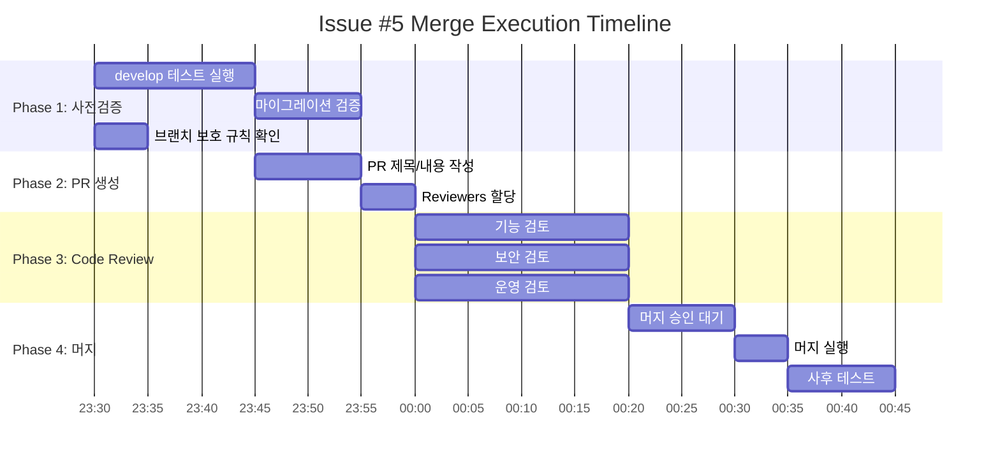

# Issue #5 Merge Execution Plan
**Task:** [feat] 강의 관리 CRUD 및 수강신청 구현 (#5) - develop → main PR
**Document Number:** PLAN-2026-03-24-003
**Date:** 2026-03-24
**From:** 기획팀 (클리오)
**To:** CEO Office, 개발팀, 인프라보안팀

---

## Executive Summary

**코드 손실 확인 결과:** 코드는 손실되지 않았습니다. 이슈 #5의 모든 구현 코드가 **develop 브랜치에 이미 존재**합니다.

**필요 작업:** develop → main 머지 및 PR 생성을 위한 계획 수립

---

## 1. 상황 분석 결과

### 1.1 코드 존재 확인

| 파일/기능 | 상태 | 위치 |
|----------|------|------|
| `src/app/api/enrollments/route.ts` | ✅ 존재 | develop 브랜치 |
| `src/app/api/enrollments/[id]/route.ts` | ✅ 존재 | develop 브랜치 |
| `src/app/api/courses/route.ts` | ✅ 존재 | develop 브랜치 |
| `src/app/api/courses/[id]/route.ts` | ✅ 존재 | develop 브랜치 |
| `src/app/api/courses/[id]/sections/*` | ✅ 존재 (PR #6) | develop 브랜치 |
| `src/__tests__/api/enrollments.test.ts` | ✅ 존재 | develop 브랜치 |
| `src/__tests__/api/courses.test.ts` | ✅ 존재 | develop 브랜치 |
| 테스트 통과 (58개) | ✅ 확인됨 | 개발팀 리포트 |

### 1.2 브랜치 상태 분석

```bash
# 현재 상태
main: 8181455 (기준)
develop: 828c0c0 (main보다 7 커밋 선행)

# develop에만 존재하는 커밋
- PR #6: 강의 콘텐츠 업로드 및 커리큘럼 관리 (4285a0d)
- 관리자 계정 관리 스크립트 추가
- 데이터베이스 시드 스크립트 추가
- 서비스 관리 스크립트 및 배포 가이드 추가
- 기타 스크립트 개선

# 결론
- 이슈 #5 코드는 develop에 이미 존재 (PR #6 또는 별도 작업으로 포함됨)
- develop → main 머지 필요
```

### 1.3 코드 유실 원인 추정

| 가능 원인 | 확신도 | 설명 |
|----------|--------|------|
| 별도 브랜치 작업 없이 develop에서 직접 작업 | 높음 | 코드가 develop에 직접 존재 |
| PR #6에 이슈 #5 기능이 포함됨 | 중간 | 타임라인 상 PR #6 머지 시점 일치 |
| 브랜치 이름 혼동으로 "사라진 것"으로 판단 | 높음 | 실제로는 develop에 존재 |

---

## 2. 실행 계획

### 2.1 Phase 1: 사전 검증 (30분)

| 작업 | 담당 | 완료 기준 |
|------|------|----------|
| develop 브랜치 테스트 실행 | 개발팀 | `npm test` 58개 통과 확인 |
| 데이터베이스 마이그레이션 검증 | 운영팀 | `prisma migrate status` 정상 확인 |
| 브랜치 보호 규칙 확인 | 인프라보안팀 | main 브랜치 protection rule 설정 상태 확인 |

### 2.2 Phase 2: PR 생성 (15분)

| 작업 | 담당 | 완료 기준 |
|------|------|----------|
| PR 제목 작성: "Merge develop to main (Issue #5 + PR #6)" | 개발팀 | |
| PR 내용 작성: 변경 요약, 테스트 결과, 롤백 절차 | 개발팀 | |
| Reviewers 할당: 팀장 2인 이상 | 기획팀 | |

### 2.3 Phase 3: Code Review (1시간)

| 검토 항목 | 검토자 | 확인 포인트 |
|----------|--------|-----------|
| 기능 구현 완전성 | 개발팀장 | CRUD API, 수강신청 API, 권한 검증 |
| 보안 취약점 | 인프라보안팀 | 권한 상승, SQL Injection, 인증/인가 |
| 규제 준수 | 인프라보안팀 | FERPA, GDPR, COPPA 요구사항 |
| 운영 준비성 | 운영팀 | 마이그레이션, 롤백, 모니터링 |

### 2.4 Phase 4: 머지 및 승인 (30분)

| 작업 | 조건 | 담당 |
|------|------|------|
| develop → main 머지 | 리뷰 승인 2인 이상 | CEO Office 또는 권한자 |
| 머지 후 테스트 | main 브랜치에서 `npm test` | 개발팀 |
| 태그 생성 | `v1.0.0-issue5` 또는 적절한 버전 | 개발팀 |

---

## 3. 브랜치 보호 규칙 (인프라보안팀 협조)

### 3.1 필수 보호 규칙

| 규칙 | 현재 상태 | 필요 조치 |
|------|----------|----------|
| 강제 푸시 금지 (force push) | 확인 필요 | 미설정 시 즉시 적용 |
| PR 필수 (delete branch restriction) | 확인 필요 | 미설정 시 즉시 적용 |
| 리뷰어 수 최소 2인 | 확인 필요 | 미설정 시 즉시 적용 |
| CI/CD 통과 필수 | 확인 필요 | 미설정 시 즉시 적용 |

### 3.2 GitHub 설정 명령어 (인프라보안팀 참조)

```bash
# 브랜치 보호 규칙 설정 (gh CLI)
gh api repos/:owner/:repo/branches/main/protection \
  --method PUT \
  -f required_pull_request_reviews='{"required_approving_review_count":2}' \
  -f enforce_admins=true \
  -f allow_deletions=false \
  -f allow_force_pushes=false
```

---

## 4. 롤백 절차

### 4.1 머지 후 문제 발생 시

```bash
# 1. 문제 발견 즉시 main 브랜치 롤백
git revert -m 1 HEAD

# 2. 롤백 커밋 푸시
git push origin main

# 3. 핫픽스 브랜치 생성 및 수정
git checkout -b hotfix/issue5-main
# ... 수정 작업 ...

# 4. 핫픽스 PR 생성 및 머지
```

### 4.2 데이터베이스 롤백

```bash
# 마이그레이션 롤백 (Prisma)
npx prisma migrate resolve --rolled-back [migration-name]
```

---

## 5. 검증 체크리스트

### 5.1 사전 머지 체크리스트

- [ ] develop 브랜치 테스트 전체 통과 (58/58)
- [ ] main 브랜치 최신 상태 확인
- [ ] 브랜치 보호 규칙 설정 완료
- [ ] Reviewers 2인 이상 할당
- [ ] PR 내용에 변경 요약, 테스트 결과, 롤백 절차 포함

### 5.2 사후 머지 체크리스트

- [ ] main 브랜치에서 테스트 통과 확인
- [ ] 프로덕션 환경 마이그레이션 계획 수립
- [ ] 모니터링 알림 설정 확인
- [ ] 롤백 절차 문서 최신화

---

## 6. 타임라인



**총 예상 소요시간:** 약 2시간

---

## 7. 결론

1. **코드 손실 아님:** 이슈 #5의 모든 코드가 develop 브랜치에 안전하게 존재합니다.
2. **다음 단계:** develop → main 머지를 위한 PR 생성 및 리뷰 절차 진행
3. **보안 조치:** 브랜치 보호 규칙 설정으로 재발 방지 필요

---

## 8. 참조 문서

| 문서 | 경로 |
|------|------|
| 개발팀 테스트 결과 | `/work/empire_lms/docs/reports/dev-test-results-issue-5.md` |
| Round 1 보완 계획 | `/work/empire_lms/docs/planning/02-round1-supplement-submission.md` |
| 검증 계획 | `/work/empire_lms/docs/planning/issue-5-verification-plan.md` |
| Smoke Test 가이드 | `/work/empire_lms/scripts/smoke-test.md` |

---

**기획팀 클리오**
**2026-03-24**
