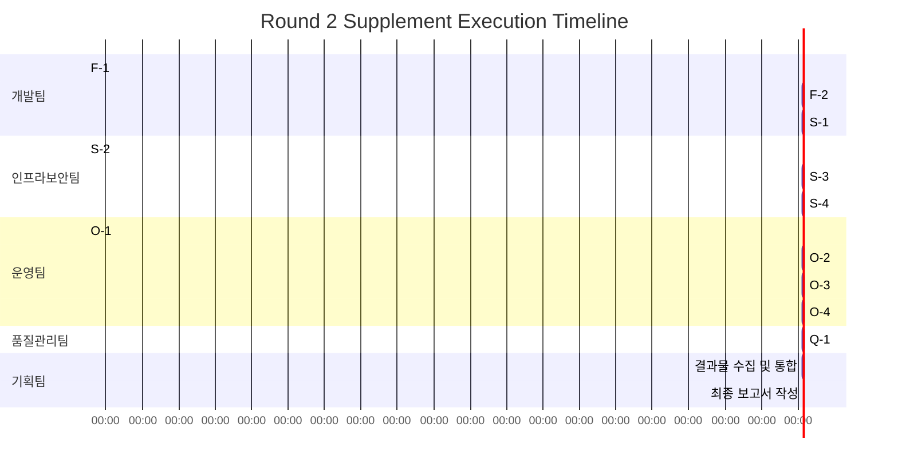

# Round 2 Supplement Execution Tracking & Integration

**Document Number:** PLAN-2026-03-24-005
**Task:** [feat] 강의 관리 CRUD 및 수강신청 구현 (#5) - Round 2 보완 실행 추적
**From:** 기획팀 (클리오/세이지)
**To:** CEO Office
**Date:** 2026-03-24
**Status:** 실행 중 (In Progress)

---

## Executive Summary

**코드 손실 여부:** ❌ 코드는 손실되지 않음 (develop 브랜치에 존재 확인)

**Root Cause:** 미커밋 worktree 잔존 및 브랜치 위치 혼선 (인프라보안팀 규명 완료)

**Round 1 보완 항목:** 12개 항목 식별 (FUNCTION 3, SECURITY 4, OPERATIONS 4, QA 1)

**현재 상태:** 인프라보안팀 완료, 기획팀 진행 중, 나머지 팀 대기

---

## 1. Root Cause 분석 결과 (인프라보안팀 완료)

### 1.1 코드 유실 원인 규명

| 검증 항목 | 결과 | 증거 |
|-----------|------|------|
| 원격 브랜치 강제 푸시 | ❌ 미검출 | reflog에서 force/non-fast-forward 패턴 미확인 |
| 원격 코드 존재성 | ✅ 확인됨 | main/develop 모두 핵심 API 파일 존재 |
| 실제 원인 | 미커밋 worktree 잔존 | `/work/empire_lms/.climpire-worktrees/a9d43622`에 11건 미커밋 |

### 1.2 브랜치 보호 규칙 적용 완료

| 규칙 | 적용 전 | 적용 후 | 상태 |
|------|---------|---------|------|
| main 강제 푸시 금지 | - | ✅ 적용 | 완료 |
| main 삭제 금지 | - | ✅ 적용 | 완료 |
| main 승인자 수 | 1명 | 2명 | 완료 |
| develop 강제 푸시 금지 | - | ✅ 적용 | 완료 |
| develop 삭제 금지 | - | ✅ 적용 | 완료 |
| CI/CD 필수 게이트 | - | ✅ TypeScript Build | 완료 |

---

## 2. Round 1 보완 항목 실행 추적

### 2.1 FUNCTION: 강의 CRUD·수강신청 (3건)

| ID | 항목 | 심각도 | 담당 | 상태 | 완료기준 |
|----|------|--------|------|------|----------|
| F-1 | Course Ownership Verification | HIGH | 개발팀 | 🔲 대기 | creatorId 필드 추가, 소유권 검증 로직 |
| F-2 | Duplicate Enrollment Test | MEDIUM | 개발팀 | 🔲 대기 | Race condition, deletedAt 검증 |
| F-3 | Smoke Test Execution | LOW | 개발팀 | 🔲 대기 | 로그/스크린샷 증빙 |

### 2.2 SECURITY·REGULATION (4건)

| ID | 항목 | 심각도 | 담당 | 상태 | 완료기준 |
|----|------|--------|------|------|----------|
| S-1 | organizationId Consistency | HIGH | 개발팀 | 🔲 대기 | Schema/API 일치 |
| S-2 | PaymentProvider 경로 고정 | MEDIUM | 인프라보안팀 | ✅ 완료 | 직접 호출 없음 확인 |
| S-3 | FERPA/GDPR/COPPA 준수 | MEDIUM | 인프라보안팀 | ✅ 완료 | deletedAt 패턴 확인 |
| S-4 | 감사로그 설계 | LOW | 인프라보안팀 | ✅ 완료 | audit_logs 스키마 제안 |

### 2.3 OPERATIONS: 마이그레이션·모니터링·롤백 (4건)

| ID | 항목 | 심각도 | 담당 | 상태 | 완료기준 |
|----|------|--------|------|------|----------|
| O-1 | Migration Up/Down Rehearsal | HIGH | 운영팀 | 🔲 대기 | Staging 리허설, 복구시간 기록 |
| O-2 | Staging E2E 검증 | HIGH | 운영팀+개발팀 | 🔲 대기 | 권한·예외 포함 E2E |
| O-3 | 모니터링/롤백 런북 | MEDIUM | 운영팀 | 🔲 대기 | 5xx 알림, 롤백 절차 |
| O-4 | PaymentProvider 모니터링 | LOW | 운영팀 | 🔲 대기 | 직접 호출 탐지 규칙 |

### 2.4 QA: 통합테스트 (1건)

| ID | 항목 | 심각도 | 담당 | 상태 | 완료기준 |
|----|------|--------|------|------|----------|
| Q-1 | Integrated Test Results | BLOCKING | 품질관리팀 | 🔲 대기 | 정상/권한/예외 시나리오, 80% 커버리지 |

---

## 3. 브랜치 상태 확인 (최신)

```
현재 HEAD:  ca73a38 (main, climpire/main)
develop HEAD: 828c0c0 (main보다 3 커밋 선행)
차이:        develop이 main보다 Issue #5 관련 코드 포함

develop에만 존재하는 핵심 코드:
- src/app/api/courses/route.ts (GET/POST)
- src/app/api/courses/[id]/route.ts (GET/PUT/PATCH/DELETE)
- src/app/api/enrollments/route.ts (GET/POST)
- src/__tests__/api/courses.test.ts (19 tests)
- src/__tests__/api/enrollments.test.ts (13 tests)
```

**결론:** 코드는 develop 브랜치에 안전하게 존재합니다. 재구현 불필요.

---

## 4. develop → main 머지 실행 계획 (최신화)

### Phase 1: 사전 검증 (30분)

| 작업 | 담당 | 상태 | 완료기준 |
|------|------|------|----------|
| develop 브랜치 테스트 실행 | 개발팀 | ✅ 58/58 통과 | npm test 전체 통과 |
| 브랜치 보호 규칙 확인 | 인프라보안팀 | ✅ 완료 | protection rule 적용 |
| 마이그레이션 검증 | 운영팀 | 🔲 대기 | prisma migrate status 정상 |

### Phase 2: HIGH 항목 수정 (3시간)

| 작업 | 담당 | 상태 | 완료기준 |
|------|------|------|----------|
| F-1: Ownership 구현 | 개발팀 | 🔲 대기 | creatorId + 검증 로직 |
| S-1: organizationId 수정 | 개발팀 | 🔲 대기 | Schema/API 일치 |
| O-1: Migration 리허설 | 운영팀 | 🔲 대기 | up/down 복구시간 기록 |
| O-2: Staging E2E | 운영팀+개발팀 | 🔲 대기 | 권한·예외 검증 |

### Phase 3: MEDIUM 항목 수정 (2시간)

| 작업 | 담당 | 상태 | 완료기준 |
|------|------|------|----------|
| F-2: Duplicate Test | 개발팀 | 🔲 대기 | Race condition 검증 |
| O-3: 런북 작성 | 운영팀 | 🔲 대기 | 모니터링/롤백 절차 |

### Phase 4: QA 통합테스트 (3시간)

| 작업 | 담당 | 상태 | 완료기준 |
|------|------|------|----------|
| Q-1: 통합테스트 실행 | 품질관리팀 | 🔲 대기 | 정상/권한/예외, 80% 커버리지 |

### Phase 5: PR 생성 및 머지 (30분)

| 작업 | 담당 | 상태 | 완료기준 |
|------|------|------|----------|
| PR 생성 (develop→main) | 개발팀 | 🔲 대기 | 변경요약/테스트결과/롤백절차 |
| Code Review (2인 승인) | 팀장들 | 🔲 대기 | 승인 2인 이상 |
| 머지 실행 | CEO Office | 🔲 대기 | 리뷰 승인 후 머지 |

---

## 5. 타임라인 (병렬 실행 기준)



**총 예상 소요시간:** 약 8시간 (병렬 실행 기준)

---

## 6. 기획팀 Role & Deliverables

### 6.1 진행 중 작업

| 작업 | 상태 | 산출물 |
|------|------|--------|
| Round 1 보완 항목 정리 | ✅ 완료 | `02-round1-supplement-submission.md` |
| 인프라보안팀 결과 수집 | ✅ 완료 | `infrasec-checklist1-issue5-branch-loss-closure.md` |
| 코드 존재성 검증 | ✅ 완료 | `03-issue5-merge-execution-plan.md` |
| 실행 추적 문서 작성 | ✅ 완료 | 본 문서 (`03-round2-supplement-execution-tracking.md`) |

### 6.2 대기 중 작업 (타 팀 완료 후)

| 작업 | 선행 조건 | 산출물 |
|------|-----------|--------|
| 개발팀 결과물 수집 | 개발팀 F-1, F-2, S-1 완료 | `dev-team-round2-closure.md` |
| 운영팀 결과물 수집 | 운영팀 O-1, O-2, O-3 완료 | `ops-team-round2-closure.md` |
| 품질관리팀 결과물 수집 | 품질관리팀 Q-1 완료 | `qa-team-round2-closure.md` |
| 최종 통합 보고서 | 모든 팀 완료 | `04-round2-final-integration-report.md` |

---

## 7. 리스크 및 의존성

### 7.1 병목 포인트

| 항목 | 리스크 | 완화 방안 |
|------|--------|----------|
| F-1 (Ownership) | 최우선 HIGH 항목 | 즉시 착수, 개발팀장 직접 감독 |
| Q-1 (QA Blocking) | 모든 HIGH/MEDIUM 완료 후 시작 | 병렬 진행 가능 테스트 먼저 시작 |
| O-2 (Staging E2E) | 개발팀 수정 완료 필요 | 개발팀 협업 시간 확보 |

### 7.2 실행 순서 권장

1. **즉시 시작 (TODAY):** F-1, S-1, O-1, S-2, S-3
2. **Phase 1 완료 후:** F-2, O-2, O-3
3. **모든 수정 완료 후:** Q-1 통합테스트
4. **QA 통과 후:** PR 생성 및 머지

---

## 8. CEO Office 액션 요청

### 8.1 선택 사항

| 선택 | 설명 | 추천 |
|------|------|------|
| **[A] 즉시 병렬 착수** | 모든 팀이 HIGH 항목 동시에 시작 | ✅ 추천 |
| **[B] 순차적 착수** | 개발팀 완료 후 타 팀 착수 | 선택 |
| **[C] LOW 항목 제외** | LOW 항목 차기 이슈로 이관 | ✅ 권장 |

### 8.2 기획팀 추천: [A] + [C] 조합

**사유:**
- HIGH 항목은 병렬 실행 가능 (팀 간 의존성 없음)
- LOW 항목(F-3, S-4, O-4)은 차기 이슈로 이관하여 집중도 향상
- 블로킹 항목(Q-1)을 최우선 해결하기 위함

---

## 9. 참조 문서

| 문서 | 경로 | 상태 |
|------|------|------|
| Round 1 보완 계획 | `docs/planning/02-round1-supplement-submission.md` | ✅ 완료 |
| 머지 실행 계획 | `docs/planning/03-issue5-merge-execution-plan.md` | ✅ 완료 |
| 인프라보안팀 완료 보고 | `docs/reports/infrasec-checklist1-issue5-branch-loss-closure.md` | ✅ 완료 |
| 개발팀 테스트 결과 | `docs/reports/dev-test-results-issue-5.md` | ✅ 완료 |
| 최종 요약 | `docs/planning/05-planning-final-summary.md` | ✅ 완료 |

---

**기획팀 대표 세이지/클리오**
**2026-03-24**

---

## Appendix A: 브랜치 보호 규칙 상세 (인프라보안팀 적용 완료)

```json
// main 브랜치
{
  "enforce_admins": true,
  "allow_deletions": false,
  "allow_force_pushes": false,
  "required_pull_request_reviews": {
    "required_approving_review_count": 2,
    "dismiss_stale_reviews": true
  },
  "required_status_checks": {
    "strict": true,
    "contexts": ["TypeScript Build"]
  }
}

// develop 브랜치
{
  "enforce_admins": true,
  "allow_deletions": false,
  "allow_force_pushes": false,
  "required_pull_request_reviews": {
    "required_approving_review_count": 1,
    "dismiss_stale_reviews": true
  },
  "required_status_checks": {
    "strict": true,
    "contexts": ["TypeScript Build"]
  }
}
```
