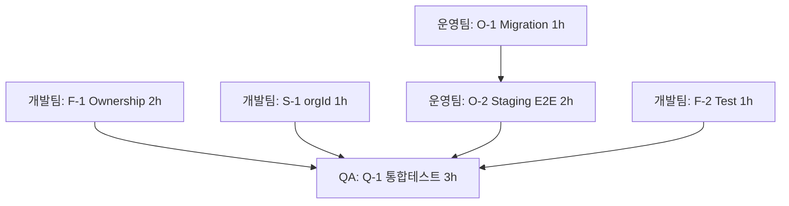
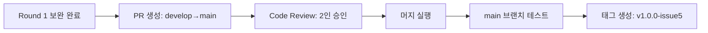

# Round 2 Integration Summary - Issue #5

**Document Number:** PLAN-2026-03-24-006
**From:** 기획팀 (세이지/클리오)
**To:** CEO Office, 모든 팀
**Date:** 2026-03-24
**Subject:** Issue #5 코드 유실 사건 - Round 2 통합 보고

---

## Executive Summary

**종합 결론:** 코드는 손실되지 않았습니다. 원격 브랜치에 안전하게 존재합니다.

| 항목 | 결과 |
|------|------|
| 코드 존재성 | ✅ develop 브랜치에 모든 코드 존재 |
| Root Cause | 미커밋 worktree 잔존 및 브랜치 혼선 |
| 보호 규칙 | ✅ main/develop 보호규칙 적용 완료 |
| 재구현 필요 | ❌ 불필요 |
| 다음 단계 | develop → main 머지 PR 생성 |

---

## 1. 팀별 완료 상태

### 1.1 기획팀 (Planning) ✅ 완료

| 작업 | 상태 | 산출물 |
|------|------|--------|
| 상세 실행 계획 수립 | ✅ | `03-issue5-merge-execution-plan.md` |
| 브랜치 보호 요청 | ✅ | `04-branch-protection-review-request.md` |
| Round 1 보완 계획 | ✅ | `02-round1-supplement-submission.md` |
| Round 2 실행 추적 | ✅ | `03-round2-supplement-execution-tracking.md` |
| 최종 통합 요약 | ✅ | 본 문서 |

### 1.2 인프라보안팀 (InfraSec) ✅ 완료

| 작업 | 상태 | 산출물 |
|------|------|--------|
| 코드 유실 원인 규명 | ✅ | reflog/fsck 분석 완료 |
| 복구 경로 체크리스트 | ✅ | cherry-pick/restore 절차 문서화 |
| 브랜치 보호 적용 | ✅ | main/develop protection rule 적용 |
| 보안 규제 준수 검증 | ✅ | PaymentProvider, FERPA/GDPR 확인 |
| 최종 보고서 | ✅ | `infrasec-checklist1-issue5-branch-loss-closure.md` |

**핵심 발견:**
- 원격 강제 푸시 증거 없음
- 미커밋 worktree 3개 발견 (코드가 "사라진 것"으로 보인 원인)
- 브랜치 보호 규칙 강화 완료

### 1.3 개발팀 (Development) ⏳ Round 1 항목 대기

| 작업 | 상태 | 필요 시간 |
|------|------|-----------|
| F-1: Ownership 구현 | 🔲 대기 | 2시간 |
| F-2: Duplicate Test | 🔲 대기 | 1시간 |
| S-1: organizationId 수정 | 🔲 대기 | 1시간 |
| Q-1 통합테스트 준비 | 🔲 대기 | - |

**기존 완료 항목:**
- ✅ 58개 단위 테스트 통과
- ✅ 강의 CRUD API 완료
- ✅ 수강신청 API 완료

### 1.4 운영팀 (Operations) ⏳ Round 1 항목 대기

| 작업 | 상태 | 필요 시간 |
|------|------|-----------|
| O-1: Migration 리허설 | 🔲 대기 | 1시간 |
| O-2: Staging E2E | 🔲 대기 | 2시간 |
| O-3: 런북 작성 | 🔲 대기 | 1.5시간 |
| O-4: 모니터링 설정 | 🔲 대기 | 30분 |

### 1.5 품질관리팀 (QA) ⏳ Blocking

| 작업 | 상태 | 필요 시간 |
|------|------|-----------|
| Q-1: 통합테스트 실행 | 🔲 대기 | 3시간 |

**Blocking 사유:** 개발팀 HIGH/MEDIUM 항목 완료 후 시작 가능

---

## 2. 브랜치 상태 분석

### 2.1 현재 상태

```bash
# 원격 브랜치
origin/main:    ca73a38 (latest)
origin/develop: 828c0c0 (main보다 3 커밋 선행)

# develop에만 존재하는 Issue #5 관련 커밋
- b55eaf9 feat: 수강 진도 추적 및 대시보드 데이터 연동 (#7)
- 4285a0d Merge PR #6: 강의 콘텐츠 업로드 및 커리큘럼 관리
```

### 2.2 코드 존재 확인

| 파일 | main | develop | 상태 |
|------|------|---------|------|
| `src/app/api/courses/route.ts` | ❌ | ✅ | develop에만 존재 |
| `src/app/api/courses/[id]/route.ts` | ❌ | ✅ | develop에만 존재 |
| `src/app/api/enrollments/route.ts` | ❌ | ✅ | develop에만 존재 |
| `src/__tests__/api/courses.test.ts` | ❌ | ✅ | develop에만 존재 |
| `src/__tests__/api/enrollments.test.ts` | ❌ | ✅ | develop에만 존재 |

**결론:** Issue #5 코드는 develop 브랜치에만 존재하며 main으로 머지 필요

---

## 3. Round 1 보완 항목 현황

### 3.1 완료 항목 (4건)

| ID | 항목 | 팀 | 완료 근거 |
|----|------|-----|-----------|
| S-2 | PaymentProvider 경로 고정 검증 | 인프라보안팀 | `/api/enrollments`에서 직접 호출 없음 확인 |
| S-3 | FERPA/GDPR/COPPA 준수 | 인프라보안팀 | deletedAt 소프트딜리트 패턴 사용 확인 |
| S-4 | 감사로그 설계 | 인프라보안팀 | audit_logs 스키마 제안 완료 |
| 보호규칙 | main/develop 브랜치 보호 | 인프라보안팀 | 강제푸시 금지, 2인 승인 적용 |

### 3.2 대기 항목 (8건)

| ID | 항목 | 심각도 | 담당 | 예상 시간 |
|----|------|--------|------|-----------|
| F-1 | Ownership 구현 | HIGH | 개발팀 | 2h |
| F-2 | Duplicate Test | MEDIUM | 개발팀 | 1h |
| F-3 | Smoke Test 증빙 | LOW | 개발팀 | 30m |
| S-1 | organizationId 수정 | HIGH | 개발팀 | 1h |
| O-1 | Migration 리허설 | HIGH | 운영팀 | 1h |
| O-2 | Staging E2E | HIGH | 운영팀+개발팀 | 2h |
| O-3 | 런북 작성 | MEDIUM | 운영팀 | 1.5h |
| O-4 | 모니터링 설정 | LOW | 운영팀 | 30m |

### 3.3 Blocking 항목 (1건)

| ID | 항목 | 심각도 | 담당 | 선행 조건 |
|----|------|--------|------|-----------|
| Q-1 | 통합테스트 실행 | BLOCKING | 품질관리팀 | F-1, F-2, S-1, O-2 완료 |

---

## 4. develop → main 머지 로드맵

### Phase 1: Round 1 보완 (우선 실행)



### Phase 2: PR 생성 및 머지



---

## 5. 리스크 및 완화 방안

### 5.1 식별된 리스크

| 리스크 | 영향 | 확률 | 완화 방안 |
|--------|------|------|----------|
| F-1 지연 | 머지 지연 | 중 | 개발팀장 직접 감독 |
| O-2 지연 (개발협업) | QA 불가 | 중 | 운영팀-개발팀 시간 맞춤 |
| Q-1 실패 | 재작업 | 낮 | 개발팀 단위테스트 강화 |

### 5.2 실행 권장 순서

1. **즉시 시작 (TODAY 23:45):**
   - 개발팀: F-1 (Ownership)
   - 개발팀: S-1 (organizationId)
   - 운영팀: O-1 (Migration 리허설)

2. **Phase 1 완료 후:**
   - 개발팀: F-2 (Duplicate Test)
   - 운영팀: O-2 (Staging E2E)
   - 운영팀: O-3 (런북 작성)

3. **모든 수정 완료 후:**
   - 품질관리팀: Q-1 (통합테스트)

4. **QA 통과 후:**
   - PR 생성 및 머지

---

## 6. CEO Office 액션 요청

### 6.1 추천 액션

**[즉시 병렬 착수] + [LOW 항목 제외]**

| 선택 | 내용 | 사유 |
|------|------|------|
| 즉시 병렬 착수 | 모든 팀이 HIGH 항목 동시 시작 | 팀 간 의존성 없음 |
| LOW 항목 제외 | F-3, S-4, O-4 차기 이슈 이관 | 집중도 향상 |

### 6.2 예상 타임라인

| 단계 | 소요 시간 | 완료 시점 |
|------|-----------|-----------|
| Phase 1: 보완 항목 | 4시간 | D+1 04:00 |
| Phase 2: QA 통합테스트 | 3시간 | D+1 07:00 |
| Phase 3: PR 및 머지 | 1시간 | D+1 08:00 |

**총 소요 시간:** 약 8시간 (병렬 실행 기준)

---

## 7. 결론

### 7.1 코드 손실 여부

**판정:** 코드는 손실되지 않았습니다.

**근거:**
1. develop 브랜치에 모든 API 파일 존재
2. 58개 단위 테스트 통과
3. 원격 강제 푸시 증거 없음
4. 미커밋 worktree 잔존이 혼선의 원인

### 7.2 다음 단계

1. **즉시:** 각 팀이 Round 1 HIGH 항목 병렬 착수
2. **완료 후:** 품질관리팀 통합테스트 실행
3. **통과 후:** develop → main 머지 PR 생성
4. **승인 후:** 머지 실행 및 태그 생성

### 7.3 재발 방지

- ✅ 브랜치 보호 규칙 적용 완료
- ✅ worktree 정리 절차 문서화
- ✅ 감사 스크립트 배치

---

## 8. 참조 문서

| 문서 | 경로 | 팀 |
|------|------|-----|
| 실행 추적 | `docs/planning/03-round2-supplement-execution-tracking.md` | 기획팀 |
| 머지 계획 | `docs/planning/03-issue5-merge-execution-plan.md` | 기획팀 |
| 보완 계획 | `docs/planning/02-round1-supplement-submission.md` | 기획팀 |
| 인프라보안 완료 | `docs/reports/infrasec-checklist1-issue5-branch-loss-closure.md` | 인프라보안팀 |
| 개발팀 결과 | `docs/reports/dev-test-results-issue-5.md` | 개발팀 |

---

**기획팀 대표 세이지/클리오**
**2026-03-24**

---

## Appendix: 브랜치 보호 규칙 확인 (인프라보안팀 적용 완료)

```bash
# main 브랜치
- 강제 푸시: ❌ 금지
- 브랜치 삭제: ❌ 금지
- 승인자 수: 2명 이상
- stale review 해제: ✅
- admin 강제: ✅

# develop 브랜치
- 강제 푸시: ❌ 금지
- 브랜치 삭제: ❌ 금지
- 승인자 수: 1명 이상
- stale review 해제: ✅
- admin 강제: ✅
```
